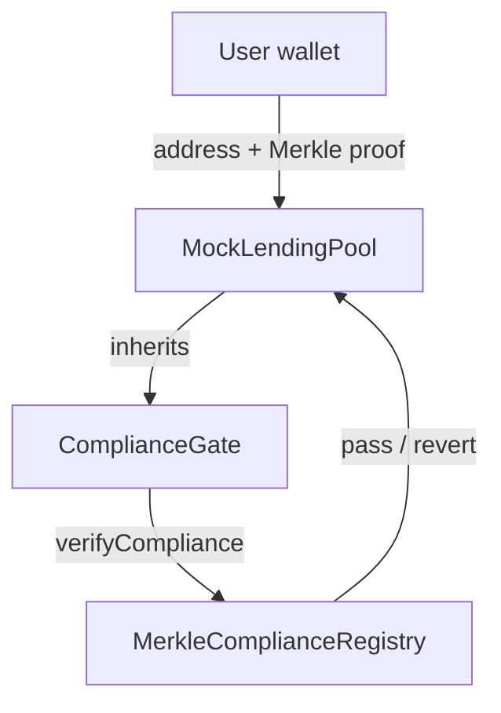
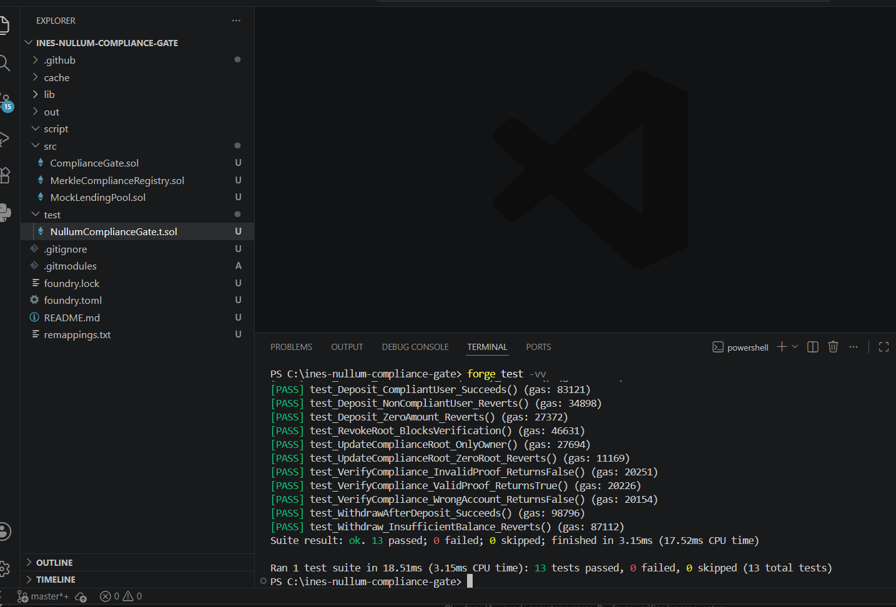

# ines-nullum-compliance-gate

A Merkle-tree-based on-chain compliance layer for institutional DeFi protocols. Enables permissioned access control without exposing sensitive identity data on-chain.

**Network:** Ethereum Sepolia (Testnet)
**Status:** Deployed & Verified

---

## Overview

As regulatory frameworks such as MiCA push institutional participants toward on-chain finance, DeFi protocols increasingly need a way to restrict access to verified, compliant counterparties — without sacrificing the trustless, permissionless nature that makes smart contracts useful in the first place.

This repository implements a pragmatic solution: a Merkle-root-based compliance registry that any protocol can adopt via a single inherited contract and modifier. Verified addresses prove their inclusion in a compliance set using a Merkle proof. The full set of approved addresses is never stored or revealed on-chain — only a single commitment root is.

The design intentionally mirrors the building blocks of zero-knowledge identity systems (commitment roots, proof verification, revocation), implemented here with Merkle proofs as a gas-efficient, fully auditable foundation that can later be extended toward zk-SNARK-based verification.

---

## Architecture



**`MerkleComplianceRegistry.sol`**
Source of truth for compliance status. Stores a single Merkle root representing the set of approved addresses, with owner-controlled root updates and root revocation.

**`ComplianceGate.sol`**
Abstract base contract exposing the `onlyCompliant` modifier. Any protocol contract can inherit from it to gate specific functions behind a compliance check, without touching its core business logic.

**`MockLendingPool.sol`**
Reference implementation showing how an existing DeFi primitive (deposit, withdraw, borrow, repay) adopts institutional compliance gating with minimal integration overhead — the same pattern applies directly to protocols such as [nexus-lend](https://github.com/BlockchainInes/nexus-lend).

---

## Deployed Contracts (Sepolia)

| Contract | Address | Etherscan |
|---|---|---|
| `MerkleComplianceRegistry` | `0x391F0CD30DEdd0b9C1F933186054192e4D4f093b` | [View](https://sepolia.etherscan.io/address/0x391f0cd30dedd0b9c1f933186054192e4d4f093b) |
| `MockLendingPool` | `0xF4149d24E019132D59B979DD2b1712818fF2C7B6` | [View](https://sepolia.etherscan.io/address/0xf4149d24e019132d59b979dd2b1712818ff2c7b6) |

Both contracts are verified on Etherscan, with full source code publicly available.

---

## Tech stack

- Solidity `^0.8.20`
- Foundry (Forge for testing and deployment)
- OpenZeppelin Contracts v5.6.1 (`Ownable`, `MerkleProof`)
- Ethereum Sepolia testnet

---

## Testing

The test suite covers registry verification logic, root management (update/revoke), access control, and full integration with the `MockLendingPool` lifecycle under both compliant and non-compliant conditions.



Ran 13 tests for test/NullumComplianceGate.t.sol:NullumComplianceGateTest

Suite result: ok. 13 passed; 0 failed; 0 skipped

Run locally:

```bash
forge test -vv
```

---

## Setup & deployment

```bash
forge install OpenZeppelin/openzeppelin-contracts
forge build
forge test -vv

# Deploy (requires .env with PRIVATE_KEY, SEPOLIA_RPC_URL,
# ETHERSCAN_API_KEY, INITIAL_COMPLIANCE_ROOT)
forge script script/Deploy.s.sol --rpc-url $SEPOLIA_RPC_URL --broadcast --verify
```

---

## Design rationale

Storing a full address whitelist on-chain is expensive and exposes every approved counterparty publicly — undesirable for institutions with confidentiality requirements. Committing only to a Merkle root achieves:

- **Gas efficiency** — O(log n) verification regardless of whitelist size
- **Privacy** — the full address set is never published on-chain
- **Revocability** — roots can be invalidated without redeploying dependent contracts
- **Composability** — any protocol adopts the gate via simple inheritance

This serves as a foundation that can be extended toward full zero-knowledge identity verification (e.g., zk-SNARK-based proof of KYC status without revealing the underlying credential), while remaining fully functional and auditable today using standard Merkle proofs.

---

## License

MIT